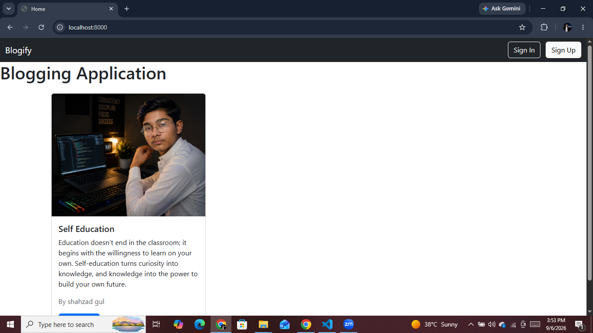
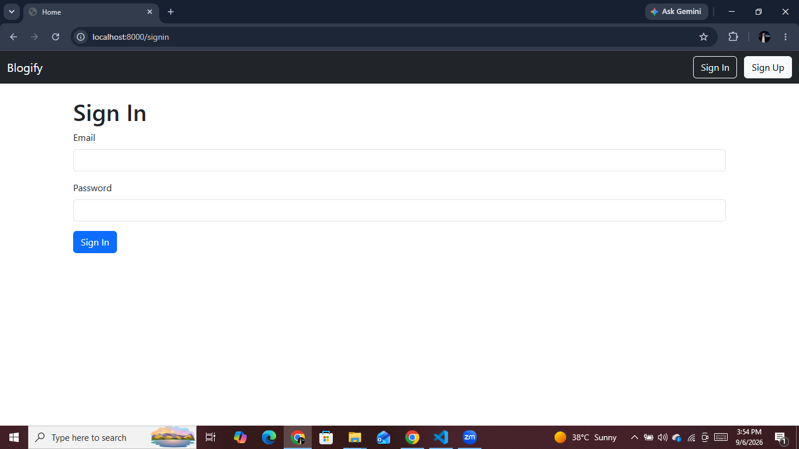
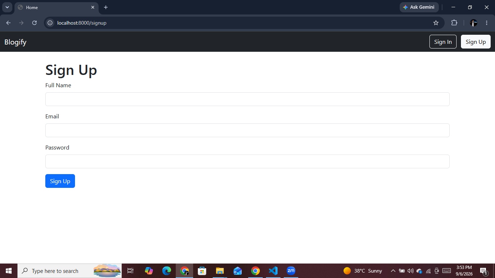
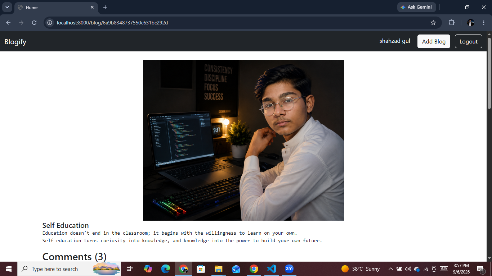
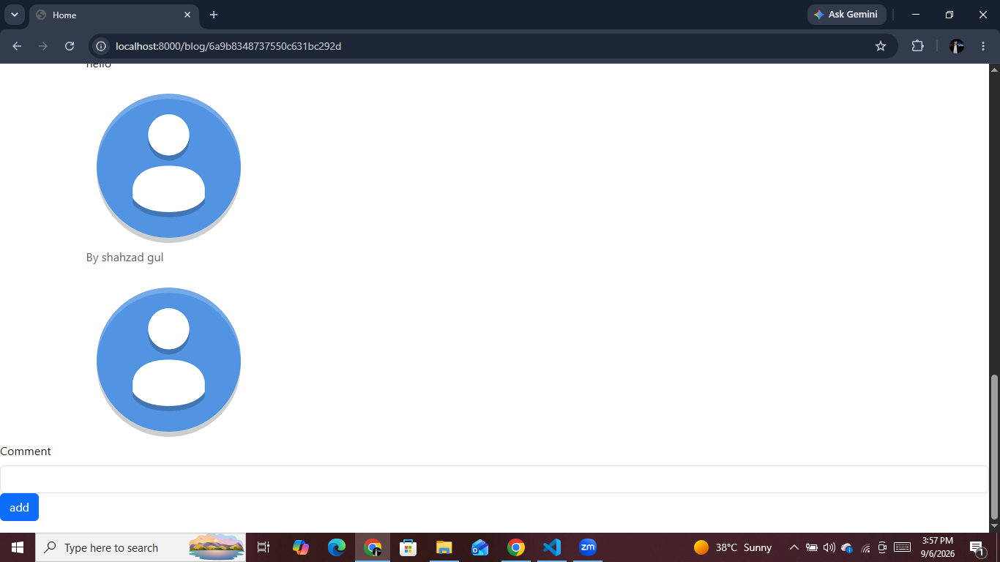

# 📝 Blogging Application

A full-stack blogging application built with **Node.js, Express.js, MongoDB, Mongoose, EJS, JWT, and Multer**.

I built this project to practice building a complete server-side web application with user authentication, blog creation, image uploads, comments, MongoDB relationships, and an MVC-style project structure.

---

## 📸 Screenshots

### Home Page



### Sign In



### Sign Up



### View Blog



### Add Comment



---

## 🚀 Features

* User signup and login
* JWT-based authentication
* HTTP-only authentication cookie
* User roles (`USER` / `ADMIN`)
* Create blog posts
* Upload blog cover images
* Image-only upload validation
* Server-generated unique upload filenames
* View individual blog posts
* Add comments to blog posts
* Display blog and comment authors
* MongoDB data storage with Mongoose
* Mongoose `populate()` for related user data
* Server-side input validation
* Duplicate email handling during signup
* Authentication-protected blog creation
* Authentication-protected comments
* Authentication-aware navigation
* Logout functionality
* Basic error handling for important database operations
* Responsive interface using Bootstrap

---

## 🛠️ Technologies Used

### Backend

* **Node.js**
* **Express.js**
* **MongoDB**
* **Mongoose**

### Frontend

* **EJS**
* **Bootstrap 5**

### Authentication & Security

* **JSON Web Token (JWT)**
* **Cookie Parser**
* Node.js **Crypto** for password hashing
* HTTP-only cookies
* **dotenv** for environment variables

### File Uploads

* **Multer**

### Development Tools

* **Nodemon**
* **Git**
* **GitHub**

---

## 📂 Project Structure

```text
project-blogging-application/
│
├── connection/
│   └── connection.js
│
├── controllers/
│   ├── blog.js
│   └── user.js
│
├── middleware/
│   └── authentication.js
│
├── models/
│   ├── blog.js
│   ├── comment.js
│   └── user.js
│
├── public/
│   └── images/
│       ├── default.png
│       └── myPhoto.png
│
├── routes/
│   └── user.js
│
├── services/
│   └── authentication.js
│
├── screenshots/
│   ├── home.png
│   ├── signin.png
│   ├── signup.png
│   ├── viewblog.png
│   └── addcomment.png
│
├── views/
│   ├── addBlog.ejs
│   ├── blog.ejs
│   ├── home.ejs
│   ├── signin.ejs
│   ├── signup.ejs
│   │
│   └── partials/
│       ├── head.ejs
│       ├── nav.ejs
│       └── script.ejs
│
├── .gitignore
├── index.js
├── package.json
└── package-lock.json
```

---

## 🔐 Authentication

The application uses **JWT-based authentication**.

When a user signs in:

1. The submitted email and password are verified.
2. A JWT is generated containing the required user information.
3. The token is stored in an HTTP-only cookie.
4. Authentication middleware checks the token on incoming requests.
5. The authenticated user is attached to `req.user`.

The JWT secret and MongoDB connection string are stored in environment variables instead of being hard-coded in the source code.

---

## 👤 User System

Users can:

* Create an account
* Sign in
* Sign out
* Create blog posts after authentication
* Add comments after authentication
* View blogs and their authors

The user model also contains a `role` field with `USER` and `ADMIN` values for future authorization-related functionality.

---

## 📝 Blog System

Authenticated users can create blog posts containing:

* Title
* Body
* Cover image
* Author

Each blog is stored in MongoDB and connected to its creator using a Mongoose reference.

Individual blog pages display:

* Blog cover image
* Title
* Body
* Author
* Comments

---

## 💬 Comments

Authenticated users can add comments to individual blog posts.

Each comment contains:

* Comment content
* Author
* Related blog
* Creation/update timestamps

The server checks authentication and validates the comment before creating it.

---

## 🖼️ Image Uploads

Blog cover images are uploaded using **Multer**.

The upload system includes:

* Image-only file validation
* Unique filenames using timestamps
* Storage inside `public/images/`

The application stores the image path with the blog document rather than storing the actual image inside MongoDB.

> **Deployment note:** The current implementation uses local filesystem storage for uploaded images. For a larger production application, persistent cloud storage such as Cloudinary or Amazon S3 would be a better solution.

---

## ✅ Validation & Error Handling

The application includes basic server-side validation and error handling for important operations.

Examples include:

* Empty blog titles are rejected.
* Empty blog bodies are rejected.
* Empty comments are rejected.
* Duplicate signup emails are handled.
* Invalid or nonexistent blog IDs return an appropriate response.
* Important database operations have basic error handling.
* Unauthenticated users cannot create blogs or comments.

---

## ⚙️ Environment Variables

Create a `.env` file in the project root:

```env
MONGODB_URI=your_mongodb_connection_string
JWT_SECRET=your_jwt_secret
```

Never commit the `.env` file to GitHub.

The project includes `.env` in `.gitignore`.

---

## 💻 Installation & Setup

### 1. Clone the repository

```bash
git clone https://github.com/shahzadgull46/nodejs-blogging-application.git
```

### 2. Move into the project directory

```bash
cd nodejs-blogging-application
```

### 3. Install dependencies

```bash
npm install
```

### 4. Create the `.env` file

Add your MongoDB connection string and JWT secret:

```env
MONGODB_URI=your_mongodb_connection_string
JWT_SECRET=your_jwt_secret
```

### 5. Start the application

For development:

```bash
npm run dev
```

For normal start:

```bash
npm start
```

The application runs locally at:

```text
http://localhost:8000
```

---

## 🧠 What I Practiced in This Project

While building this application, I practiced:

* Creating an Express server
* Express routing
* MVC-style project organization
* Middleware
* JWT authentication
* Cookies
* Password hashing
* MongoDB connection with Mongoose
* Mongoose schemas and models
* Mongoose document relationships
* `populate()`
* Database operations with MongoDB/Mongoose
* EJS templates
* Form handling
* Static files
* File uploads with Multer
* Server-side validation
* Error handling
* Environment variables
* Git and GitHub
* Preparing a Node.js application for deployment

---

## 🔮 Future Improvements

Possible future improvements include:

* Edit and delete blog posts
* Edit and delete comments
* Better form validation and user feedback
* Rich text editor for blog content
* Pagination
* Blog search functionality
* Cloud-based image storage
* Password hashing with a password-specific key derivation function
* More advanced role-based authorization
* Improved UI and user experience

---

## 👨‍💻 Author

**Shahzad**

This project was built as part of my journey of learning **Node.js, Express.js, MongoDB, and backend development**.

---

## 📄 License

This project is currently intended for **learning and portfolio purposes**.
